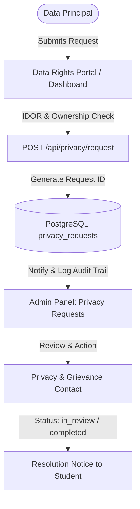

# HireeBridge DPDP Compliance & Data Protection Architecture

**Document Version:** 1.1 (Hardened Post-Audit Release)  
**Effective Date:** October 2026  
**Applicable Framework:** Digital Personal Data Protection Act, 2023 (DPDP Act 2023) & Digital Personal Data Protection Rules, 2025  
**Platform:** HireeBridge (`https://hireebridge.in`)  
**Data Fiduciary:** HireeBridge Operations / Operating Entity

---

## 1. Executive Summary & Readiness Status

HireeBridge is an online experiential learning and virtual internship platform that issues verifiable credentials. This document details the technical controls, architecture, and procedural safeguards implemented to align HireeBridge with the **Digital Personal Data Protection Act, 2023 (DPDP Act)** and applicable Rules.

### Implementation Status: **TECHNICAL CONTROLS DEPLOYED & OPERATIONAL**
- **Consent Capture:** Explicit, unbundled, itemized consent checkboxes with linked privacy notice and age verification at checkout.
- **Historical Consent Integrity:** Schema configured with `age_confirmed BOOLEAN DEFAULT NULL`. Pre-existing legacy users retain `NULL` (no false affirmative historical consent fabricated); newly enrolled students explicitly confirm age (`TRUE`).
- **Data Subject Rights Portal:** Public self-service portal (`/data-rights`) and authenticated Student Dashboard tab (`#tab-privacy`) supporting Access, Rectification, Erasure, Consent Withdrawal, Nomination, and Grievance redressal.
- **Admin Privacy Operations:** Dedicated Admin view (`/admin#privacy-requests`) for operational staff to review, track, and resolve privacy requests within statutory timelines.
- **Data Minimization in Public Verification:** Public certificate verification endpoint (`/verification/:credentialId`) stripped of all unnecessary personal data (email, phone, order ID, payment IDs, internal database keys removed; only recipient display name, credential title, issue date, and credential ID exposed).
- **Security Hardening:** Upgraded password storage to cryptographically secure `scrypt` hashing with dynamic backward-compatible re-hashing of legacy records. Hardened session cookies (`HttpOnly`, `SameSite=Lax`, `Path=/`, and conditional `Secure` in production). IDOR protection on privacy APIs.
- **Automated Retention Engine:** Scheduled retention cleanup running every 6 hours to purge expired reset tokens, unverified stale orders (>30 days), and temporary artifacts according to purpose-specific retention schedules.

---

## 2. Personal Data Mapping & Inventory

HireeBridge processes digital personal data strictly required to deliver internship programs, evaluate task submissions, provide verifiable certificates, and maintain platform security.

| Category | Specific Data Elements | Source | Purpose | Lawful Basis |
| :--- | :--- | :--- | :--- | :--- |
| **Identity & Account** | Full Name, Email Address, Password (salted `scrypt` hash), Age confirmation (>18: `TRUE` / `NULL`) | User registration / Checkout form | Account authentication, portal access, personalized communications | Consent (Art. 6) / Contractual Necessity |
| **Academic & Profile** | College / University Name, Domain of Interest, Internship Duration | Application & profile update forms | Academic verification, curriculum assignment, task evaluation | Consent (Art. 6) |
| **Internship & Work Artifacts** | Task submissions, GitHub/Drive repository URLs, Project reports, Review notes | Student Dashboard (`#tab-submissions`) | Practical learning assessment, internship completion verification | Contractual performance / Educational service delivery |
| **Credential & Verification** | Credential ID, Candidate Name, Domain, Completion Date, Certificate PDF & JPG (Cloudflare R2) | Automated issuance engine | Purpose-specific tamper-evident credential verification | Legitimate Use (Verification) & Consent |
| **Transaction & Order Records** | Order ID, Payment Gateway Order ID (Cashfree), Plan selected, Amount, Timestamp | Checkout / Payment Gateway webhook | Transaction fulfillment, invoice generation, tax/audit compliance | Legal Obligation (Tax & GST regulations) |
| **Privacy & Consent Records** | User ID, Consent Type, Notice Version, IP Address, Timestamp, Withdrawal Status | Consent checkboxes (`/checkout`) | Proof of consent, regulatory compliance audit trail | Legal Obligation (DPDP Act Art. 6) |
| **Privacy Request Tickets** | Request ID, Request Type, Subject Email, Details, Status, Admin Notes, Resolution Date | `/data-rights` and `#tab-privacy` | Processing Data Subject Rights (Access, Correction, Erasure, Nomination, etc.) | Legal Obligation (DPDP Act Art. 11-14) |
| **Technical & Session Logs** | IP Address, User Agent, Session Cookie, Error stack traces | HTTP Request Headers / Server logs | Security monitoring, brute-force defense, session persistence | Legitimate Uses (Network Security & Fraud Prevention) |

---

## 3. Lawful Basis Matrix

Under DPDP Act 2023, personal data is processed under the following grounds:

1. **Consent (Section 6):**
   - General platform account creation and program onboarding.
   - Processing academic information and internship submissions.
   - Processing optional promotional updates or notifications (separate opt-in checkbox).
2. **Certain Legitimate Uses (Section 7):**
   - Compliance with applicable Indian laws (e.g., preserving invoice and transaction records for statutory accounting periods).
   - Maintenance of security safeguards, prevention of unauthorized access, fraud detection, and network incident investigation.
   - Responding to lawful directives from statutory authorities or courts of competent jurisdiction.
3. **Contractual Performance & Credential Verification Utility:**
   - Verification of credentials is an intrinsic component of the verifiable credential requested by the student upon enrolling in the certification program.

---

## 4. Consent Architecture (Section 6 & DPDP Rules)

### Technical Implementation:
- **No Pre-ticked Boxes:** Consent checkboxes on checkout are un-ticked by default (`checked=false`).
- **Granular & Unbundled:**
  1. Mandatory Privacy Notice consent (itemized with direct link to `/privacy`).
  2. Mandatory 18+ Age Declaration (ensuring compliance with adult onboarding under Section 9).
  3. Separate, optional opt-in for promotional updates (never bundled with core service access).
- **Historical Consent Integrity:**
  - `users.age_confirmed` is explicitly nullable (`BOOLEAN DEFAULT NULL`).
  - Pre-existing accounts retain `NULL`, ensuring no fictitious historical consent is asserted.
  - New enrollments set `age_confirmed = TRUE` and log an explicit consent event in `consent_records`.
- **Persistent Consent Ledger (`consent_records` table):**
  - Schema: `id`, `user_id`, `purpose`, `consent_status`, `notice_version`, `consent_timestamp`, `source`, `withdrawn_at`.
  - Every consent grant is logged immutably.
  - When consent is withdrawn via the Data Rights portal, `withdrawn_at` timestamp is committed.

---

## 5. Notice & Transparency Architecture (Section 5 & Rule 3)

The Privacy Notice (`/privacy`) has been updated with clear, plain language (English):
1. **Itemized Categories:** Discloses exact data items collected and why.
2. **Actual Third-Party Processors:** Discloses only processors actually utilized by the application (Neon PostgreSQL, Cloudflare R2, Cashfree Payments, Brevo SMTP relay, Render).
3. **Rights of Data Principals:** Outlines how to access, rectify, erase, nominate, or withdraw consent.
4. **Neutral Privacy Contact:** Published direct contact details (`help@hireebridge.in` / `privacy@hireebridge.in` under the neutral title **Privacy & Grievance Contact**).
5. **Right to Approach Data Protection Board:** Express notice of the user's right to file a complaint before the Data Protection Board of India.

---

## 6. Data Principal Rights Workflows (Sections 11, 12, 13, 14)

### Available Channels:
1. **Self-Service / Form:** Dedicated public portal at `https://hireebridge.in/data-rights`.
2. **Authenticated Student Dashboard:** Dedicated `Account & Privacy` tab (`/dashboard#tab-privacy`).
3. **Direct Email:** Neutral Privacy & Grievance desk at `help@hireebridge.in`.

### Workflow & Lifecycle:

- **Right to Access (Section 11):** Users receive a structured summary of personal data held, processing history, and identities of third parties with whom data was shared.
- **Right to Correction & Updating (Section 12):** Users can rectify inaccurate, incomplete, or outdated personal or academic information.
- **Right to Erasure (Section 12):** 
  - Queues an erasure request in `privacy_requests` for operational review.
  - Erases student account profile, task submissions, and non-essential records.
  - *Statutory Exceptions:* In accordance with data protection principles, financial invoices, accounting records, and fraud-prevention audit logs required by statutory law (GST regulations, Companies Act) are retained in an access-restricted state until statutory expiry.
  - *Credential Consistency:* The deletion request workflow avoids accidental deletion of verifiable credentials unless explicit revocation is requested. If a student requests deletion of their account but wishes for their issued credential to remain verifiable, the public ledger retains only the credential ID and award metadata. If complete credential revocation is demanded, certificate PDF/JPG artifacts are deleted from Cloudflare R2 and marked revoked in the database.
- **Right to Nominate (Section 14):** 
  - Candidates can register a nominee through `/data-rights` (request type: `nomination`).
  - Nominee details (Full Name, Contact Parameters, Relationship, and Scope of Authority) are recorded.
  - *Operational Safeguard:* In the event of death or incapacity, verification of legal representation or relationship is required prior to releasing or modifying account assets.
- **Right of Grievance Redressal (Section 13):** Grievance submissions are assigned high priority and tracked to resolution within statutory timelines (not exceeding 30 calendar days).

---

## 7. Data Retention & Purpose-Specific Schedules (Section 8(7) & Rule 8)

*No blanket claim of indefinite retention is asserted. Data is retained strictly as necessary for the specific purposes for which it was collected:*

| Record Type | Purpose-Specific Retention Period | Post-Period Action | Justification |
| :--- | :--- | :--- | :--- |
| **Student Account & Profile Data** | Duration of active enrollment and platform relationship | Account archival / deletion upon verified request | Educational program continuity, dispute resolution |
| **Project Submissions & Code** | Tenure of program plus up to 12 months post-completion | Pruned or archived | Portfolio access, evaluation review, and academic integrity |
| **Financial & Invoice Records** | 7 Years from end of relevant financial year | Archived in restricted store | Statutory compliance under Indian tax and corporate laws |
| **Credential & Verification Records** | For as long as necessary to facilitate tamper-evident verification by prospective employers upon candidate request | Secure registry archives / deleted or revoked upon candidate request | Facilitates third-party employment verification; fraud prevention |
| **Password Reset Tokens** | 1 Hour maximum | Automated invalidation / deletion | Security control to prevent token reuse |
| **Incomplete Checkout Records** | 30 Days | Automated permanent purge (`runRetentionCleanup`) | Transient incomplete orders have no ongoing operational utility |
| **System Security & Audit Logs** | 90 Days to 1 Year | Overwritten / purged | Network security, incident investigation, access auditing |

---

## 8. Children & Vulnerable Persons Handling (Section 9)

- **Platform Policy:** HireeBridge offers vocational internship training designed for adult learners, university students, and job seekers aged 18 and older.
- **Age Declaration:** The checkout workflow incorporates an explicit declaration: *"I confirm that I am 18 years of age or older (or participating under parental/guardian consent)"*.
- **Historical Integrity:** Users created prior to explicit age capture are represented as `NULL` (unrecorded), preventing false claims of affirmative historical declaration.
- **No Behavioral Tracking / Targeted Ads on Minors:** The platform does not deploy third-party advertising SDKs, profiling algorithms, or behavioral tracking cookies.

---

## 9. Security Safeguards & Technical Measures (Section 8(5))

1. **Password Security:**
   - Standard: `scrypt` key derivation (`scrypt:<salt_hex>:<hash_hex>`) with 16-byte random salts.
   - Migration: Dynamic, on-the-fly re-hashing of legacy SHA-256 passwords upon successful user login.
2. **Session Security:**
   - Cookie Flags: `HttpOnly` (mitigates XSS cookie theft), `SameSite=Lax` (mitigates CSRF), `Path=/`, and conditional `; Secure` in production/HTTPS environments.
3. **Access Controls & Authorization (IDOR Protection):**
   - Authenticated student requests are strictly scoped to `req.session.user.id`.
   - Data privacy requests can only be queried or modified by the authenticated owner or authenticated Super Admin (`requireAdmin`).
4. **Public Surface Minimization:**
   - The public verification route (`/verification/:credentialId`) exposes only what is strictly necessary to authenticate the award: Student Display Name, Domain, Issue Date, and Verification Status. Sensitive personal data (email, phone, home address, order IDs, amount paid) is completely stripped.
5. **Safe Data Storage Coordination:**
   - Cloudflare R2 bucket credentials and storage operations are executed server-side; credentials are never exposed to browser clients.

---

## 10. Actual Third-Party Data Processors Inventory

| Service Provider | Role in Codebase | Data Elements Processed | Processing Infrastructure | Safeguards |
| :--- | :--- | :--- | :--- | :--- |
| **Neon Tech Inc. (AWS)** | Primary Relational Database | Student accounts, submissions, orders, privacy logs | AWS Cloud Data Centers (Singapore `ap-southeast-1`) | Encrypted at rest (AES-256), encrypted in transit (TLS 1.3), automated backups |
| **Cloudflare R2** | Cloud Object Storage | Generated certificate PDFs and JPGs | Cloudflare Global Distributed Network | Private bucket, server-side pre-signed/proxied downloads only |
| **Cashfree Payments** | Payment Gateway | Transaction tokens, order amount, payment status | RBI-licensed banking networks in India | Full PCI-DSS Level 1 compliance; no raw card data touches HireeBridge |
| **Brevo (Sendinblue) / Nodemailer** | SMTP Transactional Relay | Recipient Email, Recipient Name, Program Notices | EU / Global Cloud Infrastructure | TLS encryption in transit, strict API/SMTP token authentication |
| **GreyRocks Digital Engineering** | Credential Verification Partner | Credential ID, Candidate Name, Domain, Issue Date | `greyrocks.in` Verification Registry | Tamper-evident verification registry; zero private account data |
| **Render Services Inc.** | Application Cloud Hosting | Application runtime environment and logs | Secure AWS/GCP Cloud Infrastructure | Isolated container execution, TLS termination |

*Note: Razorpay was audited and confirmed not in active use by the platform codebase. The Privacy Policy and disclosures accurately reflect Cashfree Payments exclusively.*

---

## 11. Cross-Border Processing Review — Pending Legal/Operational Verification

The technical implementation utilizes cloud infrastructure whose physical hosting locations are documented below:
- **Database Layer (Neon PostgreSQL):** Cloud instance hosted on AWS (default Singapore `ap-southeast-1` or designated AWS region).
- **Certificate Object Storage (Cloudflare R2):** Distributed edge object storage network.
- **Transactional Email Relay (Brevo):** Global SMTP infrastructure with primary servers located in the European Union.
- **Payment Processing (Cashfree Payments):** Domestic Indian payment infrastructure licensed by the Reserve Bank of India (data retained within India).
- **Platform Application Runtime (Render):** Cloud application hosting nodes.

> [!NOTE]
> Under Section 16 of the DPDP Act 2023, transfers of personal data outside India are permissible unless the Central Government restricts transfer to specific countries by notification. As of October 2026, negative list notifications are pending gazette issuance. Formal cross-border adequacy and vendor DPA execution remain subject to ongoing legal/operational verification by company counsel. No unsupported legal claims are made.

---

## 12. REQUIRES HUMAN / LEGAL DECISION

The following operational, policy, and legal items cannot be resolved solely through software engineering and require explicit determination by HireeBridge leadership and legal counsel:

1. **Formal Designation of Statutory Data Protection Officer (DPO):**
   - *Current Implementation:* Platform uses neutral title **Privacy & Grievance Contact** routing to `help@hireebridge.in`.
   - *Legal Action Required:* If HireeBridge is classified as a Significant Data Fiduciary (SDF) under Section 10 of the DPDP Act, formally appoint an individual based in India as the statutory DPO and publish required statutory credentials.
2. **Data Processing Agreements (DPAs) with Third Parties:**
   - *Current Implementation:* Operational data flows to Neon, Cloudflare, Brevo, and Cashfree are functional.
   - *Legal Action Required:* Execute updated DPDP-aligned Data Processing Addenda (DPAs) with all sub-processors.
3. **Formalization of Certificate Archival Policy:**
   - *Current Implementation:* Credential records are retained to maintain verification utility for alumni.
   - *Legal Action Required:* Formalize institutional legal policy on whether uncollected or superseded credentials should be archived after a defined tenure.
4. **Verifiable Parental Consent Integration for Minors (<18):**
   - *Current Implementation:* Self-declaration checkbox on checkout suitable for adult vocational training.
   - *Legal Action Required:* Monitor the final notification of DPDP 2025 Rules regarding verifiable parental consent (e.g., tokenized Aadhaar/DigiLocker) if expanding enrollment to minors.
5. **Nominee Verification Procedure:**
   - *Current Implementation:* Nomination requests captured and logged in `privacy_requests`.
   - *Legal Action Required:* Establish standard operating procedure (SOP) for legal verification of nominee identity prior to granting access or control over a deceased or incapacitated candidate's account.
